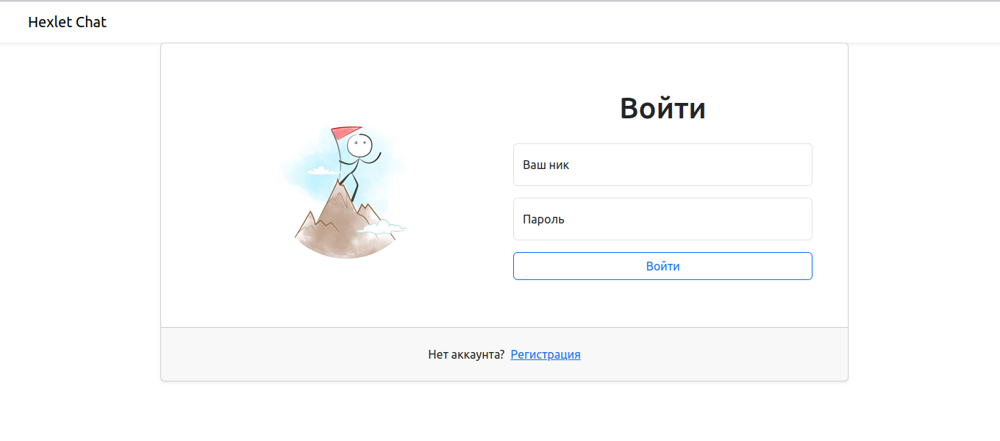
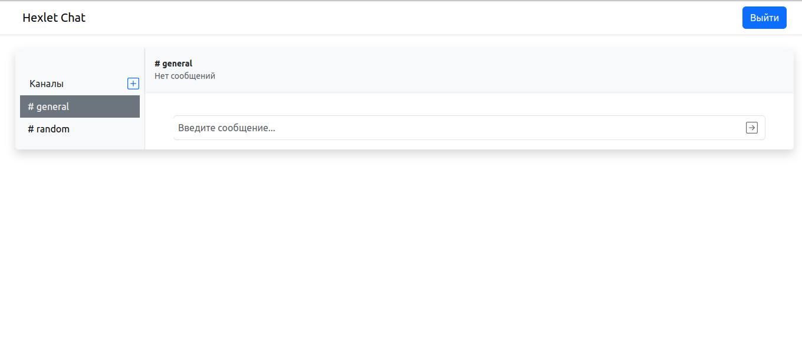
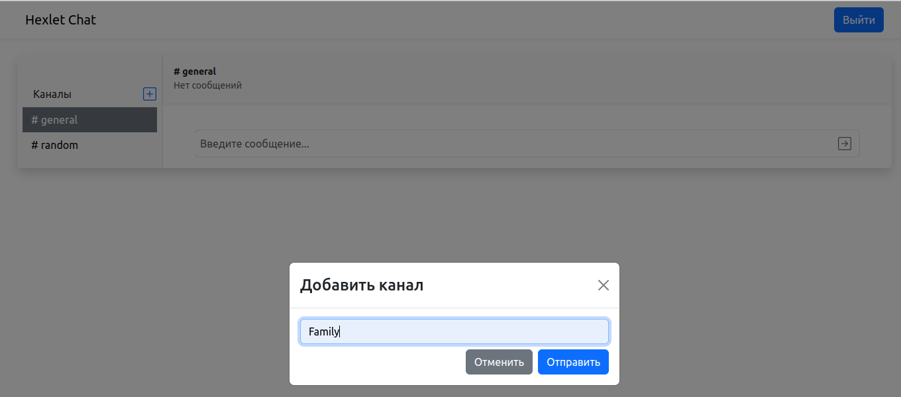
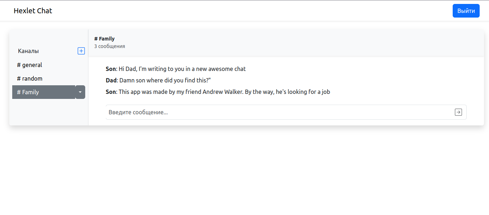

[](https://github.com/andrew-walker91/frontend-project-12/actions) [](https://codeclimate.com/github/andrew-walker91/frontend-project-12/maintainability) [](https://github.com/andrew-walker91/frontend-project-12/actions/workflows/linter-check.yml)

# Hexlet Chat:

Hello! My name is Andrey Gulyaykin and this is my fourth **frontend** project on Hexlet.


## Description:

Hexlet Chat is a simplified version of Slack, where you can exchange messages in real time, create, delete and rename channels.

The project implements filtering of obscene words, notification of user actions using pop-up messages.

The project uses web sockets, interaction with the REST API, the use of React (with hooks), Redux (via reduxjs/toolkit), the organization of routing on the client, as well as user authorization and authentication.

## Installation:

Just 3 commands for a quick start

```
git clone git@github.com:andrew-walker91/frontend-project-12
make install
make start
```
## How to use:
 - Register or log in with an administrator account

    - Login: `admin`
    - Password: `admin`


 - Write something in the channels created by default
 - Create a channel using ➕ on the left side of the application
 - Enjoy this unobtrusive notification of successful channel creation
 - You can express your delight even with the help of bad words, the application will take care of it

 ## Tech stack

 - React / React Hooks - user interfaces
 - Redux / Redux Toolkit - state container
 - Bootstrap - CSS Framework
 - Socket.io - WebSocket based browser-server communication
 - Axios - HTTP requests
 - Formik - building forms on React
 - Yup - form validation
 - I18next - manage text
 - React-toastify - pop-up notifications
 - Leo-profanity - profanity filter
 - Rollbar - error tracking

## Demonstration:  
### Login page:
\


### Sign up page:
\


### Main page:
\


### Add channel:
\


### Chat page:
\


ㅤ
<details>
 <summary>Click to watch the demo video</summary>
 [](https://www.youtube.com/watch?v=1zwhI0CKF3I)

</details>

ㅤ
ㅤ
ㅤ


# Click [here](https://chat-hexlet.up.railway.app/) to try in the browser
